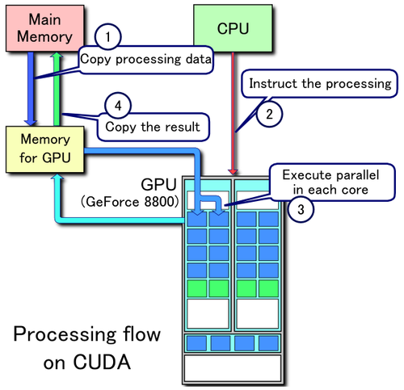

분석: GPU는 스케줄링을 어떻게 할까?

1. CPU VS GPU
- GPU는 CPU에서 부족한 병렬연산(ex 부동 소숫점 연산)을 강점으로 가져 나타나게 되었으며, 최근에는 GPGPU와 같이 범용 계산 또한 도와줄수 있는 방식으로도 나타나고 있고 AI/ML분야에서 많이 사용되고 있다.

2. GPU의 구조
- GPU는 다수의 프로세서를 가지고 있고, 각 프로세스는 하나의 thread를 가지고있다.
- GPU에서 이 thread들을 묶어 warp, wavefront라 부르며 이 단위로 명령을 실행한다.
- GPU 메모리의 경우 CPU로 부터 받은 명령을 가지고 있으며, 해당 내용을 많은 프로세스에게 전달해야 해서 용량과, 대역폭이 중요하다.
- 이외에 thread block, SM, warp, SP와 같은 단위로 구성되어있다.
- 스케쥴러의 경우 thread block scheduler, warp scheduler등이 있다.

3. GPU의 작동 (CPU <-> GPU)
- CPU에서 GPU를 필요로 하는 명령어 연산
- 해당 내용을 그래픽 드라이버를 통해 GPU 메모리에 적재
- GPU 메모리의 명령을 GPU가 연산 
- 연산 결과를 그래픽 드라이버를 통해 CPU 메모리에 전달
 
 4. GPU 내부의 동작
 - 메모리에 CPU의 연산 명령이 들어옴
 - thread block scheduler가 연산 명령을 Thread Block으로 나눔
 - 라운드 로빈 방식으로 SM에 돌아가면서서 1개씩 Thread Block을 전달
 - SM에서 warp scheduler를 통해 Streaming Processor에게 warp 단위의 thread 할당 
 - warp단위로 gpu kernel 명령 실행 , 완료
 - Streaming Processor가 쉬고있으면 warp scheduler가 pending 상태의 warp를 스케쥴링하여 할당

5. GPU의 context swich
- CPU의 경우 한 스레드의 문맥을 저장하고, 복원해야 하기때문에 많은 시간이 소요된다.
- GPU의 문맥은 각 스레드가 SM 레지스터 파일에서 할당한 자체 개인 레지스터를 가지고 있어 문맥 저장, 복원에 데이터 이동이 필요없다.
- GPU의 L1캐시는 SM과 함께 스케쥴링된 워프들 간에 공유되기때문에 캐시적중률에 훨씬 적은 영향을 미쳐 문맥교환에 CPU보다 많은 장점이 있습니다.

결론
GPU는 병렬 처리를 장점이 있으며 최근에는 AI/ML에 많은 병렬 연산이 필요하여 많은 수요가 있습니다.
작동 방식은 수많은 프로세스들을 묶어 병렬 연산에 사용하며, 스케쥴링을 통해 묶음별로 연산이 진행됩니다.
CPU와 달리 context switch에 있어 메모리를공유하거나 개인 레지스터를 가지고 있다는 점이 오버헤드를 감소시켜 좋은 성능을 가지게 해줍니다.

== 자료조사 ==

1. CPU와 GPU의 차이
- CPU는 소수의 고성능 코어를 가지고있으며 순차적인 프로그램(Sequential Program)의 실행 속도에 강점을 가지고있다.  (latency-oriented design)
- GPU는 다수의 코어를 가지고 있으며 병렬 프로그램에 처리에 감점을 가지고 있다. (throughput-oriented design)

2. GPGPU
-GPGPU(General-Purpose computing on Graphics Processing Units, GPU 상의 범용 계산)는 일반적으로 컴퓨터 그래픽스를 위한 계산만 맡았던 그래픽 처리 장치(GPU)를, 전통적으로 중앙 처리 장치(CPU)가 맡았던 응용 프로그램들의 계산에 사용하는 기술이다.
-GPGPU를 활용하기 위해서는 이를 지원하는 GPU뿐 아니라 GPU의 명령어셋을 사용할 수 있게 해주는 소프트웨어 레이어가 필요한데, 대표적으로 NVIDIA의 CUDA와 범용으로 사용 가능한 OpenCL이 있습니다.

3. CUDA
-CUDA("Compute Unified Device Architecture", 쿠다)는 그래픽 처리 장치(GPU)에서 수행하는 (병렬 처리) 알고리즘을 C 프로그래밍 언어를 비롯한 산업 표준 언어를 사용하여 작성할 수 있도록 하는 GPGPU 기술이다.

CUDA 처리 흐름의 예
1. 메인 메모리를 GPU 메모리로 복사
2. CPU가 GPU에 프로세스를 지시함
3. GPU가 각 코어에 병렬 수행
4. GPU 메모리로부터의 결과물을 메인 메모리에 복사

- 쿠다의 이점 (vs 전통적인 범용 GPU)
--흩뿌린 읽기 - 코드가 메모리의 임의 위치에서 데이터를 읽을 수 있다.
--공유 메모리 - 쿠다는 고속 공유 메모리 지역 (16 또는 48KB 크기) 을 드러내어 스레드 간에 나눌 수 있게 해 준다. 이는 사용자 관리 캐시로 사용될 수 있는데, 텍스처 룩업을 이용하는 경우 보다 더 빠른 대역폭이 가능해진다.
--디바이스 상의 읽기, 쓰기가 호스트보다 더 빠르다.
--정수와 비트 단위 연산을 충분히 지원한다. 정수 텍스처 룩업이 포함된다.

4. GPU의 워프(warp) & 웨이브프론트(wavefront)
- GPU의 코어는 1개의 Thread를 가지고 있는데, 스레드의 묶음 단위를 워프(Ndivia), 웨이브프론트(AMD)라고 부른다.
- Warp 안에는 32개의 Hardware threads, 웨이브프론트 안에는  64개의 Hardware threads가 존재한다.
- SIMT : 워프, 웨이브 프론트트 같은 명령어로 동시에 동작 가능한 스레드의 집합을 의미하고, 이런 동작을 Single Instruction Multi Thread(SIMT)라고 부릅니다.

GPU Architecture

5. 아키텍쳐 분석 및 GPU 작동 순서
- 1. 프로그래머가 임의의 Kernel을 Launch
- 2. Launch된 Grid 가 Thread Block Scheduler 에게 전달
- 3. Thread Block Scheduler가 Grid를 Thread Block으로 나눈 뒤 1개씩 Streaming Multiprocessor에 Round-Robin으로 Scheduling
- 4. Streaming Multiprocesor가 내부의 Warp Scheduler를 작동하여 Streaming Processor에게 warp단위의 thread를 할당함
- 5. warp단위로 gpu kernel 명령 실행, 싱크를 맞춰야 하여 먼저 끝나는 스레드가 있어도 모든 스레드가 끝날때까지 대기후 완료
- 6. 이때 SP가 할일이 없거나 적은 경우 Warp Scheduler가 SP를 놀리지 않기 위해 pending되어있던 warp를 스케쥴링하여 sp에게 할당하게 된다. 이러한 스케쥴링 과정에서 발생하는 Context Switch의 Overhead를 Zero에 가깝게 만들어 놓은 것이 NVIDIA GPU Archtecture의 핵심이라 할 수 있다.

6. GPU의 메모리의 용량과 대역폭
- 용량 : 메모리의 용량이 큰경우 연산에 필요한 파라미터등의 내용을 담고있어 큰 경우 더많은 배치처리가 가능하다.
- 대역폭 : GPU는 코어수가 많아 넓은 메모리 영역을 동시에 읽고 써야 한다. 대역폭이 큰경우 메모리 접근에 소요되는 총 시간이 감소한다.

7. 그래픽 드라이버
-GPU (그래픽 처리 장치) 드라이버는 그래픽 카드와 운영체제 간의 연결고리 역할을 하며, 그래픽 카드 기능이 제대로 작동하도록 합니다. 드라이버는 그래픽 카드 하드웨어와 운영체제의 소프트웨어가 서로 상호작용할 수 있도록 필요한 인터페이스를 제공합니다. 

